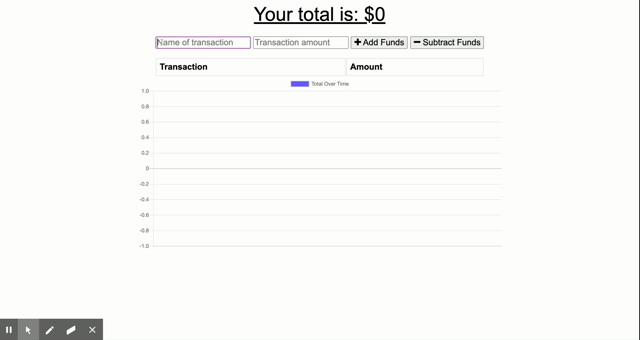

<h1 align="center">
Budget Tracker 💸💰📈📉   An Application to Track All of Your Deposits and Expenses!
</h1>

## Description

The Budget Tracker is an application that allows users to track and store deposits and expenses to keep track of their finances. A user can add new deposits or expenses while online or offline. A table is generated to show the user a log of their deposits and expenses, and a chart is generated to show the overall trend of the individual's account balance.

## Table of Contents

[1. Description](#Description) 
[2. Installation](#Installation) 
[3. Usage](#Usage) 
[4. License](#License) 
[5. Contributing](#Contributing) 
[6. Technologies](#Technologies) 
[7. Authors](#Authors) 

## Installation

This application is deployed and hosted on [Heroku](https://frozen-headland-68006.herokuapp.com/). No installation is required for use unless testing locally. If used only on your local machines, follow and install the required dependencies.

## Usage

This application can be used by those who would like to keep track of their finances. Once the application loads, a user will be prompted to enter a transaction -- either a deposit or expense -- and save the entry accordingly. A table is created to display all transactions, and a chart is created to provide a visual representation of transactions.

## License

This application is covered under the [MIT license](https://choosealicense.com/licenses/mit/).

## Contributing

If you would like to contribute to this project, please open a new issue and describe how you would like to collaborate.

## Technologies

This Budget Tracker application utilizes:

- HTML
- CSS
- JavaScript
- Mongo DB

## Authors

This application was created in conjunction with starter code provided by Trilogy Education Services and back-end coding by Mae A. Kindler.
